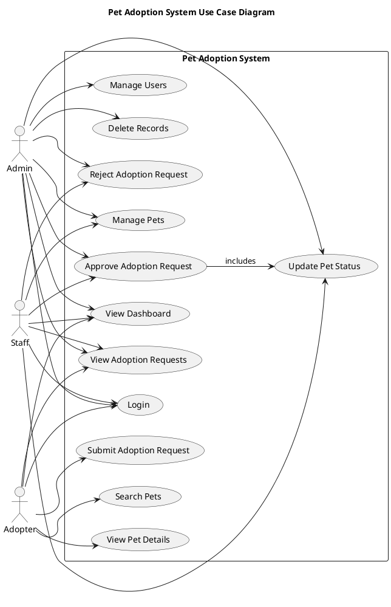
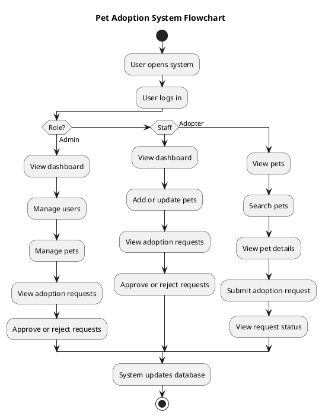
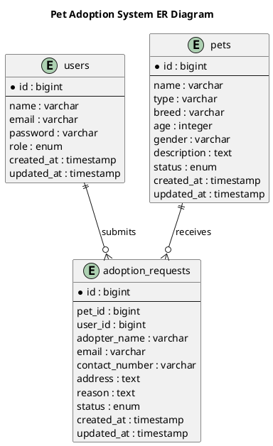
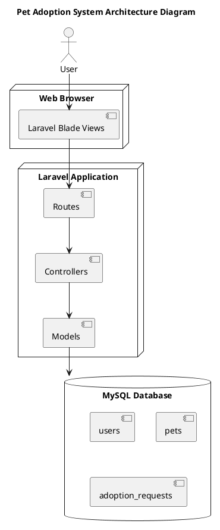

# Pet Adoption System

## Final System Project Documentation Paper

**Project Title:** Pet Adoption System  
**Name of Member:** Christian Dampil  
**Course/Subject:** Application Development and Emerging Technologies  
**Instructor's Name:** Jeremiah Dela Cruz  
**Date Submitted:** May 20, 2026  

---

## 1. Title Page

**Project Title:** Pet Adoption System  
**Name of Member:** Christian Dampil  
**Course/Subject:** Application Development and Emerging Technologies  
**Instructor's Name:** Jeremiah Dela Cruz  
**Date Submitted:** May 20, 2026  

---

## 2. Introduction

The Pet Adoption System is a web-based application developed to manage pet records and adoption requests. The system allows authorized users to log in, view the dashboard, manage pets, submit adoption requests, approve or reject requests, and manage user accounts depending on their role.

The purpose of the system is to provide an organized way of listing pets that are available for adoption and tracking pets that have already been adopted. It also helps manage adoption requests submitted by adopters.

This project is important because it reduces manual record handling and makes pet adoption management easier. It aims to solve problems such as unorganized pet information, difficulty tracking adoption status, and lack of a simple system for handling adoption requests.

---

## 3. Objectives of the System

### General Objective

To develop a web-based Pet Adoption System that manages pet records, user roles, and adoption requests using Laravel and MySQL.

### Specific Objectives

- To create a login system for admin, staff, and adopter users.
- To allow admin users to manage user accounts.
- To allow admin and staff users to add, update, and manage pet records.
- To allow adopters to search and view available pets.
- To allow adopters to submit adoption requests.
- To allow admin and staff users to approve or reject adoption requests.
- To update the pet status after an adoption request is approved.
- To store user, pet, and adoption request data in a MySQL database.

---

## 4. Scope and Limitations

### Scope

The system can:

- Allow users to log in.
- Display a dashboard.
- Manage pet records.
- Add, view, edit, and delete pet information.
- Search pets by name, type, breed, or status.
- Allow adopters to submit adoption requests.
- Allow admin and staff users to view adoption requests.
- Allow admin and staff users to approve or reject adoption requests.
- Allow admin users to manage users.
- Store data in a MySQL database.

### Limitations

The system does not include:

- Online payment.
- Email notification.
- SMS notification.
- Mobile application version.
- Pet medical history module.
- Appointment scheduling.
- Online chat between adopter and staff.

---

## 5. System Description

The Pet Adoption System is a Laravel-based web application that manages pets and adoption requests. The system uses role-based functions for admin, staff, and adopter users.

The admin can manage users, manage pets, view adoption requests, approve or reject requests, and delete records. The staff can manage pets and process adoption requests. The adopter can view pets, search available pets, view pet details, and submit adoption requests.

### Major Modules and Features

- Login module
- Dashboard module
- Pet management module
- Adoption request module
- User management module
- Search function
- Status tracking

### User Roles and Functionalities

**Admin**

- Log in to the system.
- Manage users.
- Add, view, update, and delete pets.
- View adoption requests.
- Approve or reject adoption requests.
- Delete adoption request records.

**Staff**

- Log in to the system.
- Add pet records.
- Update pet information.
- View adoption requests.
- Approve or reject adoption requests.

**Adopter**

- Log in to the system.
- Search pets.
- View pet details.
- Submit adoption requests.
- View adoption request status.

---

## 6. Technologies Used

### Programming Language

- PHP

### Frameworks/Libraries

- Laravel
- Blade templating engine

### Database Management System

- MySQL

### Development Tools Used

- XAMPP
- Visual Studio Code
- phpMyAdmin
- Composer
- Web browser

---

## 7. System Design

### Use Case Diagram

PlantUML file:

```text
docs/diagrams/use-case-diagram.puml
```



### Flowchart

PlantUML file:

```text
docs/diagrams/flowchart.puml
```



### ER Diagram / Database Design

PlantUML file:

```text
docs/diagrams/er-diagram.puml
```



### System Architecture Diagram

PlantUML file:

```text
docs/diagrams/system-architecture-diagram.puml
```



### Interface Design / Screenshots

The system interface includes:

- Login page
- Dashboard page
- Pet list page
- Add pet page
- Edit pet page
- Pet details page
- Adoption request page
- User management page

Screenshots may be inserted in this section after capturing the actual system pages from the browser.

---

## 8. Database Structure

### List of Tables

- users
- pets
- adoption_requests

### Description of Fields

#### users table

| Field | Description |
| --- | --- |
| id | Unique user ID |
| name | Name of the user |
| email | Email address used for login |
| password | Encrypted password |
| role | User role: admin, staff, or adopter |
| created_at | Date and time the record was created |
| updated_at | Date and time the record was updated |

#### pets table

| Field | Description |
| --- | --- |
| id | Unique pet ID |
| name | Name of the pet |
| type | Type of pet |
| breed | Breed of the pet |
| age | Age of the pet |
| gender | Gender of the pet |
| description | Pet description |
| status | Pet status: available or adopted |
| created_at | Date and time the record was created |
| updated_at | Date and time the record was updated |

#### adoption_requests table

| Field | Description |
| --- | --- |
| id | Unique adoption request ID |
| pet_id | Pet connected to the request |
| user_id | Adopter who submitted the request |
| adopter_name | Name of the adopter |
| email | Email of the adopter |
| contact_number | Contact number of the adopter |
| address | Address of the adopter |
| reason | Reason for adopting the pet |
| status | Request status: pending, approved, or rejected |
| created_at | Date and time the record was created |
| updated_at | Date and time the record was updated |

### Relationships Between Tables

- One user can submit many adoption requests.
- One pet can receive many adoption requests.
- Each adoption request belongs to one user.
- Each adoption request belongs to one pet.

---

## 9. Implementation and Testing

### Development Process

The system was developed using Laravel with MySQL as the database. The development started by creating the Laravel project and configuring the database connection. Migrations were created for users, pets, and adoption requests. Models, controllers, routes, and Blade views were then created to handle system functions.

The system includes login, dashboard, pet management, user management, and adoption request management. Role-based restrictions were added so that admin, staff, and adopter users can only access the functions assigned to them.

### Testing Procedures Performed

- Tested login using admin, staff, and adopter accounts.
- Tested dashboard access after login.
- Tested adding a pet as admin and staff.
- Tested editing pet information as admin and staff.
- Tested deleting pets as admin.
- Tested searching pets as adopter.
- Tested viewing pet details as adopter.
- Tested submitting adoption requests as adopter.
- Tested viewing adoption requests as staff.
- Tested approving and rejecting adoption requests as staff.
- Tested user management as admin.

### Problems Encountered

- Some Blade views were missing during development.
- Some routes pointed to views that had not been created yet.
- Some functions required role checking to prevent unauthorized access.
- Adoption request status needed to be connected to pet status.

### Solutions Applied

- Created the missing Blade view files.
- Corrected route names and controller return views.
- Added role checks in controllers.
- Added pending, approved, and rejected statuses for adoption requests.
- Updated pet status to adopted after approval.

---

## 10. Conclusion

The Pet Adoption System was successfully developed as a web-based system for managing pet records and adoption requests. The system allows admin, staff, and adopter users to perform their assigned functions.

The project achieved its purpose by providing an organized platform for listing pets, searching pets, submitting adoption requests, approving or rejecting requests, and managing users. It helps reduce manual work and improves the tracking of available and adopted pets.

During development, knowledge was gained in Laravel routing, controllers, Blade templating, models, migrations, authentication, role-based access, CRUD operations, and database relationships.

---

## 11. Recommendations

Future improvements may include:

- Pet image upload.
- Email notification for adoption request status.
- SMS notification.
- Appointment scheduling.
- Printable adoption forms.
- Adoption history reports.
- Dashboard charts.
- Mobile-friendly design improvements.
- Pet medical record management.
- Advanced search and filtering.

---

## Formatting Guidelines

Use the following format when transferring this document to a word processor:

- **Font Style:** Times New Roman
- **Font Size:** 12
- **Spacing:** 1.5
